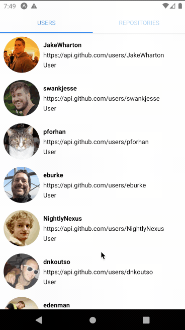

# Android Kotlin Test

## Summary

Your task is to create a two tabs in a single screen Android app using Kotlin that consume [Github REST API](https://docs.github.com/en/rest). The first tab should show a list of contributors of [Retrofit](https://github.com/square/retrofit) Github repository. And the second tab should show a list of repositories with search functionality.

Please see the preview of the finish app below,

This repository contains a starter project ready for you to work on. Feel free to add any 3rd party helpers, extensions or libraries you need.

## Setup
To compile and run the project:

- [Android SDK](http://developer.android.com/sdk/index.html)
- [API 30: Android 11](http://developer.android.com/tools/revisions/platforms.html)
- Android SDK Tools
- Android SDK Build Tools `30.0.3`
- Android Support Repository
- [Kotlin](https://kotlinlang.org/) `1.4.20`
- Kotlin plugin for Android Studio

## Submission

1. Fork this repository
2. Make some changes
3. Make a Pull Request

## Passing Criteria

- A working Android app
- Using design pattern: MVP or MVVM
- A clean and well structured code

## Reference

- Search repositories ([https://docs.github.com/en/rest/reference/search#search-repositories](https://docs.github.com/en/rest/reference/search#search-repositories))
- List repository contributors ([https://docs.github.com/en/rest/reference/repos#list-repository-contributors](https://docs.github.com/en/rest/reference/repos#list-repository-contributors))

Have fun :)

